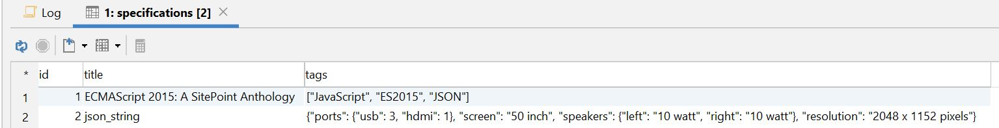
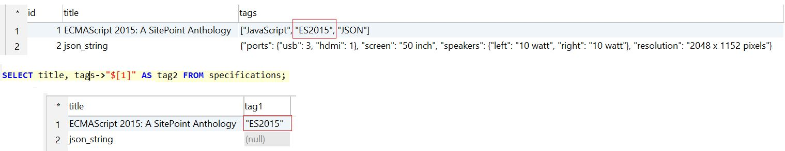
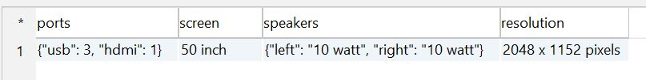
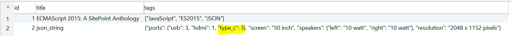
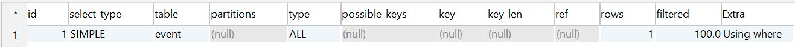
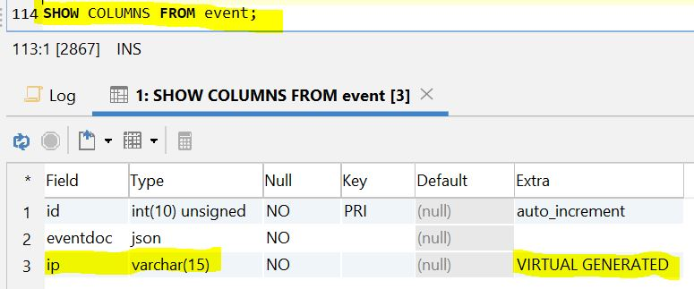
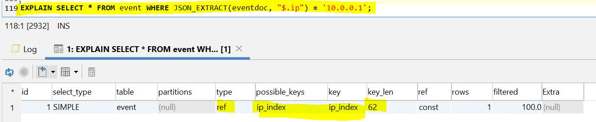

<h1 align="center">ДЗ 10</h1>
<h1 align="center">MySQL JSON</h1>

---
Использование JSON в MySQL может сэкономить ваши ресурсы, уменьшить количество записей в базе и количество дополнительных запросов.
Но лучше использовать специализированные NoSQL базы мне кажется.
Поля значений JSON не могут быть проиндексированы.

### Create table ###
```sql
--Создал таблицу для теста, поле tags типа json
CREATE TABLE specifications (
  id MEDIUMINT(8) UNSIGNED NOT NULL AUTO_INCREMENT,
  title VARCHAR(200) NOT NULL,
  tags JSON DEFAULT NULL,
  PRIMARY KEY (id)
) ENGINE=INNODB;
```

### Insert ###
```sql
INSERT INTO specifications (title, tags)
VALUES (
  'ECMAScript 2015: A SitePoint Anthology',
  '["JavaScript", "ES2015", "JSON"]'
);

INSERT INTO specifications (
    title,
    tags
)
VALUES(
    'json_string',
    '{"screen": "50 inch", "resolution": "2048 x 1152 pixels", "ports": {"hdmi": 1, "usb": 3}, "speakers": {"left": "10 watt", "right": "10 watt"}}'
);
```
### Select ###
```sql
--Смотрим типы поля tags
SELECT JSON_TYPE(tags) FROM specifications;
--1) ARRAY
--2) OBJECT
```
Данные в таблице


Результат выборки второго значания для поля tags
```sql
SELECT title, tags->"$[1]" AS tag2 FROM specifications;
```


```sql
--Возвращает значение ключа ports используя функцию JSON_EXTRACT()
SELECT JSON_EXTRACT(tags , '$.ports') FROM specifications
WHERE
title = 'json_string';
--{"usb": 3, "hdmi": 1}
--or
SELECT title, tags->'$.ports' ports FROM specifications;

--Получить только ключи структуры json
select JSON_KEYS(tags) FROM specifications;
```
Конвертировать данные JSON в реляционную таблицу
```sql
--Функция JSON_TABLE определяет типы столбцов виртуальной таблицы и связанные с ними свойства объекта JSON, из которых будет извлечено значение столбца.
SELECT specifications_table.* FROM specifications, JSON_TABLE(
tags,"$" COLUMNS(ports JSON PATH "$.ports",
                    screen VARCHAR(100) PATH "$.screen",
                    speakers JSON PATH "$.speakers",
                    resolution VARCHAR(100) PATH "$.resolution"
           )
) AS specifications_table
WHERE title = 'json_string';
```



### Update ###
```sql
--Добавили ключ type_c со значением 3
UPDATE specifications
SET tags = json_insert(tags, '$.ports.type_c', 3)
WHERE title = 'json_string';
```



### Delete ###
```sql
--Удалить ключ type_c и его значение
UPDATE specifications
SET tags = json_remove(tags, '$.ports.type_c' )
WHERE title = 'json_string';
```

### Различные функции ###
```sql
--Формирует массив
select json_array( 'programmable','fan', 'ac', 'furnace' ) json_array;
--Формирует объект
select json_object('device_id', 3001,'unixtime', 1428440461,'setting', 64.0,'current_temp', 62.05) json_object;
```

| Название функции   | Что делает                                                                                             | Пример                                                     | Результат                                 |
| ------------------ | ------------------------------------------------------------------------------------------------------ | ---------------------------------------------------------- | ----------------------------------------- |
| JSON_ARRAY         | Создать массив JSON                                                                                    | select JSON_ARRAY(1, "abc", NULL, TRUE, CURTIME());        | [1, "abc", null, true, "10:00:24.000000"] |
| JSON_OBJECT        | Создать объект JSON                                                                                    | select JSON_OBJECT('id', '1047', 'name', 'Author');        | {"id": "1047", "name": "Author"}          |
| JSON_QUOTE         | Получите данные JSON, добавив кавычки на обоих концах строки и избежав внутренних специальных символов | select JSON_QUOTE('null'), JSON_QUOTE('"null"');           |                                           |
| JSON_CONTAINS      | Определите, равно ли значение указанного пути в данных JSON указанному значению                        | select JSON_CONTAINS('{"a":1}', '1', '$.a');               |                                           |
| JSON_CONTAINS_PATH | Определите, существует ли указанный путь в данных JSON                                                 | select JSON_CONTAINS_PATH('{"a":1}', 'one', '$.a', '$.b'); |                                           |
| JSON_EXTRACT       | Получить содержимое указанного пути в данных JSON                                                      | select JSON_EXTRACT('[1,2]', '$[0]');                      |                                           |
| ->                 | Облегченная версия JSON_EXTRACT                                                                        | select f2, f2->'$.a' from t1;                              |                                           |
| JSON_KEYS          | Получить ключ в данных JSON                                                                            | select JSON_KEYS('{"a":1, "b":2}');                        |                                           |
| JSON_SEARCH        | Путь для поиска указанного значения JSON в данных JSON                                                 | select JSON_SEARCH('["a", {"f":"a"}]', 'one', 'a');        |                                           |
| JSON_ARRAY_APPEND  | Добавить данные в конец массива JSON                                                                   | select JSON_ARRAY_APPEND('[1,[2]]', '$[1]', 3);            |                                           |
| JSON_ARRAY_INSERT  | Вставьте часть данных в массив JSON                                                                    | select JSON_ARRAY_INSERT('[1,[2]]', '$[1]', 3);            |                                           |
| JSON_INSERT        | Вставьте часть данных в документ JSON                                                                  | select JSON_INSERT('{}', '$.a', 3);                        |                                           |
| JSON_REMOVE        | Удалить данные из документа JSON                                                                       | select JSON_REMOVE('[1, 2, 3]', '$[1]');                   |                                           |
| JSON_REPLACE       | Заменить данные в документе JSON                                                                       | select JSON_REPLACE('[1, 2, 3]', '$[1]', 'two');           | [1, "two", 3]                             |
| JSON_SET           | Обновите данные в документе JSON, если ключ не существует, вставьте новые данные                       | select JSON_SET('{"a":1}', '$.a', 'one', '$.b', 2);        | {"a": "one", "b": 2}                      |
| JSON_DEPTH         | Получить максимальную глубину документа JSON                                                           | select f2, JSON_DEPTH(f2) from t1;                         |                                           |
| JSON_LENGTH        | Получить количество (уровень 1) элементов данных в документе JSON                                      | select f2, JSON_LENGTH(f2) from t1;                        |                                           |
| JSON_TYPE          | Просмотр типа значения JSON                                                                            | select f2, JSON_TYPE(f2) from t1;                          |                                           |
| JSON_VALID         | Проверьте правильность значения JSON                                                                   | select f1, JSON_VALID(f1) from t1;                         |                                           |
| JSON_TABLE         | Конвертировать данные JSON в реляционную таблицу                                                       |                                                            |                                           |
| JSON_PRETTY        | Вывод документов JSON в простой для чтения формат                                                      | SELECT JSON_PRETTY('{"a":"10","b":"15","x":"25"}');        |                                           |
| JSON_STORAGE_FREE  | Получить оставшееся свободное пространство поля JSON в текущем блоке хранения                          |                                                            |                                           |
| JSON_STORAGE_SIZE  | Получить пространство памяти, занимаемое полями JSON (включая неиспользуемое пространство)             |                                                            |                                           |

### Индексы ###
У MySQL нет возможности напрямую индексировать документы JSON, но есть альтернатива: генерируемые столбцы.
Позволяет разработчикам создавать столбцы, содержащие информацию, полученную из других столбцов, предопределенных выражений или вычислений. Генерируя столбец из значений JSON, а затем индексируя его, можно практически индексировать поле с JSON.
```sql
CREATE TABLE event (
    id int(10) unsigned NOT NULL AUTO_INCREMENT,
    eventdoc json NOT NULL,
    PRIMARY KEY (id)
) ENGINE=InnoDB

EXPLAIN SELECT * FROM event WHERE JSON_EXTRACT(eventdoc, "$.ip") = '10.0.0.1';
```

```sql
ALTER TABLE event
ADD ip VARCHAR(15)
GENERATED ALWAYS AS (JSON_UNQUOTE( JSON_EXTRACT(eventdoc, '$.ip')))
VIRTUAL NOT NULL
```

```sql
CREATE INDEX ip_index ON event (ip);
```



| Database   | ver    |
| -----      | ---    |
| MySQL      | 8.0.15 |
